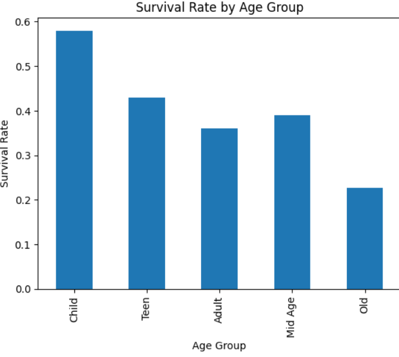

# Titanic Survival Analysis 🚢

## Objective
To analyze survival patterns of passengers based on class, age, and gender using Python, Pandas, and Matplotlib.

---

## Tools Used
- Python
- Pandas
- Matplotlib

---

## Dataset
The Titanic dataset is a real-world dataset commonly used in machine learning for classification problems.

---

## Dataset Features
- Pclass → Passenger class
- Sex → Gender
- Age → Age of passenger
- Fare → Ticket price
- Survived → Target variable (0 = No, 1 = Yes)

---

## Project Workflow
1. Data Loading  
2. Data Cleaning (handled missing values)  
3. Exploratory Data Analysis (EDA)  
4. Data Visualization  
5. Insight Generation  

---

## Key Insights
- 1st class passengers had the highest survival rate  
- 3rd class passengers had the lowest survival  
- Children had better survival chances  
- Survival decreases from higher class to lower class  
- Age and class both influence survival  

---

## Conclusion
Survival on the Titanic was not random.  
Factors like passenger class, age, and gender significantly affected survival chances.

---

## Future Improvements
- Add machine learning model  
- Predict survival using ML  
- Improve visualizations  

---
## Sample Visualization

## Author
**Vinayak Gautam**  
Aspiring AI Engineer | Data Science Enthusiast
